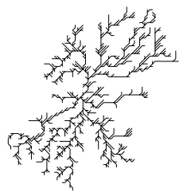

<!-- README.md is generated from README.Rmd. Please edit that file -->

```{r, echo = FALSE}
knitr::opts_chunk$set(
  collapse = TRUE,
  comment = "#>",
  fig.path = "inst/images/"
)
```

# streamnet

[](https://cran.r-project.org/package=streamnet)
[](https://www.tidyverse.org/lifecycle/#experimental)
[](https://travis-ci.org/jsta/streamnet)

Morphology analysis of stream networks 

## Installation

You can install streamnet from github with:

```{r gh-installation, eval = FALSE}
# install.packages("devtools")
devtools::install_github("jsta/streamnet")
```

## Usage

### Calculate morphology metrics

```{r grass_flag, echo=FALSE}
Sys.setenv(GRASS_VERBOSE = 0)
```

```{r setup, message=FALSE, eval=TRUE, warning=FALSE}
library(sf)
library(nhdR)
library(streamnet)
library(ggplot2)
library(raster)
```

```{r calc_metrics, message=FALSE, eval=TRUE, warning=FALSE}
data(nhd_sub_lines)
data(nhd_sub_lakes)

outlet_reach   <- terminal_reaches(network = nhd_sub_lines, 
                                   approve_all_dl = TRUE, quiet = TRUE)
outlet_point   <- st_cast(st_line_sample(outlet_reach, sample = 1), "POINT")

ggplot() +
  geom_sf(data = nhd_sub_lines) +
  geom_sf(data = outlet_point, aes(color = "red")) +
  scale_color_manual(labels = "outlet", values = "red") +
  labs(colour = "") + theme_minimal()

calc_metrics(nhd_sub_lines, nhd_sub_lakes)
```

### Simplify stream networks

```{r simplify_networks}
# Combine(dissolve) adjacent reaches with no junctions
nhd_sub_simple <- simplify_network(nhd_sub_lines)
avg_link_length(nhd_sub_simple)
avg_link_length(nhd_sub_lines)
```

### Round-trip igraph and sf lines

```{r igraph_v_sf}
tree <- create_reversed_tree(15)
class(tree)
plot(tree)

tree_sf <- igraph2sf(tree)
plot(tree_sf)
```

### Create synthetic stream networks

```{r gen_dla, eval=FALSE}
# Diffusion limited aggregation
dt <- sim_dla()
viz_dla(dt, which.max(dt))
```

```{r show_dla, echo=FALSE}

```

```{r viz_bin_raster}
# Generate from a binary raster
foo <- matrix(0, ncol = 9, nrow = 9)
foo[1:4,3] <- 1
foo[5,4]   <- 1
foo[6:9,5] <- 1
foo <- raster(foo, xmn = 1, xmx = 9, ymn = 1, ymx = 9)
origin <- which.min(apply(
              which(as.matrix(flip(foo, "y")) == 1, arr.ind = TRUE), 1, sum))
res <- raster2network(foo, origin)

par(mfrow = c(1, 2))
plot(foo)
plot(foo); plot(res, add = TRUE)
```
