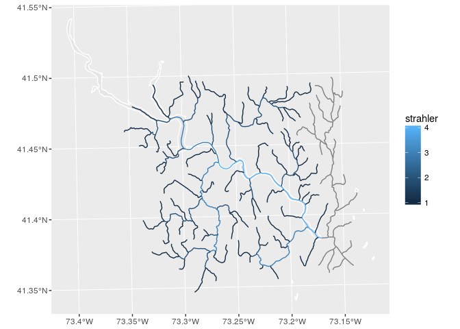

<!-- README.md is generated from README.Rmd. Please edit that file -->
streamnet
=========

Morphology analysis of stream networks

Installation
------------

You can install streamnet from github with:

``` r
# install.packages("devtools")
devtools::install_github("jsta/streamnet")
```

Usage
-----

``` r
library(sf)
#> Linking to GEOS 3.5.1, GDAL 2.2.1, proj.4 4.9.2
library(ggplot2)
library(nhdR)
#> Loading required package: maps
library(streamnet)

# Generate test dataset
bbox <- data.frame(xmin = -73.33838, ymin = 41.35841,
                   xmax = -73.14540, ymax = 41.48593)
b0 <- sf::st_sfc(sf::st_polygon(list(rbind(
    c(bbox$xmin, bbox$ymin),
    c(bbox$xmax, bbox$ymin),
    c(bbox$xmax, bbox$ymax),
    c(bbox$xmin, bbox$ymax),
    c(bbox$xmin, bbox$ymin)))))
sf::st_crs(b0) <- 4326
b0 <- st_transform(b0, sf::st_crs(nhdR::vpu_shp))

nhd <- nhd_plus_query(poly = b0, dsn = c("NHDFlowLine"))$sp$NHDFlowLine
#> although coordinates are longitude/latitude, st_intersects assumes that they are planar
#> Reading layer `NHDFlowline' from data source `/home/jose/.local/share/nhdR/NHDPlus/NE_01_NHDSnapshot/NHDFlowline.shp' using driver `ESRI Shapefile'
#> Simple feature collection with 68837 features and 14 fields
#> geometry type:  LINESTRING
#> dimension:      XYZM
#> bbox:           xmin: -73.7318 ymin: 40.98537 xmax: -66.94983 ymax: 47.45986
#> epsg (SRID):    4269
#> proj4string:    +proj=longlat +datum=NAD83 +no_defs
```

``` r

# Calculate stream order with GRASS
outlet <- terminal_reaches(
                 lon = st_coordinates(st_centroid(b0))[1], 
                 lat = st_coordinates(st_centroid(b0))[2])
#> Warning in st_centroid.sfc(b0): st_centroid does not give correct centroids
#> for longitude/latitude data

#> Warning in st_centroid.sfc(b0): st_centroid does not give correct centroids
#> for longitude/latitude data
#> although coordinates are longitude/latitude, st_intersects assumes that they are planar
#> although coordinates are longitude/latitude, st_intersects assumes that they are planar
#> Reading layer `NHDWaterbody' from data source `/home/jose/.local/share/nhdR/NHDPlus/NE_01_NHDSnapshot/NHDWaterbody.shp' using driver `ESRI Shapefile'
#> Simple feature collection with 16791 features and 12 fields
#> geometry type:  POLYGON
#> dimension:      XYZ
#> bbox:           xmin: -73.73183 ymin: 41.00171 xmax: -66.99787 ymax: 47.41783
#> epsg (SRID):    4269
#> proj4string:    +proj=longlat +datum=NAD83 +no_defs
#> Warning in st_buffer.sfc(pnt, dist = buffer_dist): st_buffer does not
#> correctly buffer longitude/latitude data
#> dist is assumed to be in decimal degrees (arc_degrees).
#> although coordinates are longitude/latitude, st_intersects assumes that they are planar
#> Reading layer `NHDFlowline' from data source `/home/jose/.local/share/nhdR/NHDPlus/NE_01_NHDSnapshot/NHDFlowline.shp' using driver `ESRI Shapefile'
#> Simple feature collection with 68837 features and 14 fields
#> geometry type:  LINESTRING
#> dimension:      XYZM
#> bbox:           xmin: -73.7318 ymin: 40.98537 xmax: -66.94983 ymax: 47.45986
#> epsg (SRID):    4269
#> proj4string:    +proj=longlat +datum=NAD83 +no_defs

outlet <- st_cast(st_line_sample(outlet, sample = 1), "POINT")

res <- stream_order(lines = nhd, outlet = outlet)
#> Default region was updated to the new projection, but if you have multiple
#> mapsets `g.region -d` should be run in each to update the region from the
#> default
#> Projection information updated
#> Writing layer `testlines' to data source `/tmp/RtmpRG9poE/file87a5dc2cfd2/PERMANENT/.tmp/josecomp/592.0' using driver `SQLite'
#> options:        LAUNDER=NO 
#> features:       286
#> fields:         14
#> geometry type:  Line String
#> Warning in execGRASS("v.in.ogr", flags = v.in.ogr_flags, input = GDSN, output = vname, : The command:
#> v.in.ogr -o --overwrite input=/tmp/RtmpRG9poE/file87a5dc2cfd2/PERMANENT/.tmp/josecomp/592.0 output=testlines layer=testlines
#> produced at least one warning during execution:
#> Over-riding projection check
#> Check if OGR layer <testlines> contains polygons...
#>    0%   2%   4%   6%   8%  10%  12%  14%  16%  18%  20%  22%  24%  26%  28%  30%  32%  34%  36%  38%  40%  42%  44%  46%  48%  50%  52%  54%  56%  58%  60%  62%  64%  66%  68%  70%  72%  74%  76%  78%  80%  82%  84%  86%  88%  90%  92%  94%  96%  98% 100%
#> Default driver / database set to:
#> driver: sqlite
#> database: $GISDBASE/$LOCATION_NAME/$MAPSET/sqlite/sqlite.db
#> WARNING: Width for column RESOLUTION set to 255 (was not specified by OGR),
#>          some strings may be truncated!
#> WARNING: Width for column GNIS_ID set to 255 (was not specified by OGR),
#>          some strings may be truncated!
#> WARNING: Width for column GNIS_NAME set to 255 (was not specified by OGR),
#>          some strings may be truncated!
#> WARNING: Width for column REACHCODE set to 255 (was not specified by OGR),
#>          some strings may be truncated!
#> WARNING: Width for column FLOWDIR set to 255 (was not specified by OGR),
#>          some strings may be truncated!
#> WARNING: Width for column FTYPE set to 255 (was not specified by OGR), some
#>          strings may be truncated!
#> WARNING: Width for column ENABLED set to 255 (was not specified by OGR),
#>          some strings may be truncated!
#> Importing 286 features (OGR layer <testlines>)...
#>    0%   2%   4%   6%   8%  10%  12%  14%  16%  18%  20%  22%  24%  26%  28%  30%  32%  34%  36%  38%  40%  42%  44%  46%  48%  50%  52%  54%  56%  58%  60%  62%  64%  66%  68%  70%  72%  74%  76%  78%  80%  82%  84%  86%  88%  90%  92%  94%  96%  98% 100%
#> -----------------------------------------------------
#> Building topology for vector map <testlines@PERMANENT>...
#> Registering primitives...
#> 
#> 286 primitives registered
#> 3201 vertices registered
#> Building areas...
#>    0%   2%   4%   6%   8%  10%  12%  14%  16%  18%  20%  22%  24%  26%  28%  30%  32%  34%  36%  38%  40%  42%  44%  46%  48%  50%  52%  54%  56%  58%  60%  62%  64%  66%  68%  70%  72%  74%  76%  78%  80%  82%  84%  86%  88%  90%  92%  94%  96%  98% 100%
#> 0 areas built
#> 0 isles built
#> Attaching islands...
#> Attaching centroids...
#>    1%   3%   5%   7%   9%  11%  13%  15%  17%  19%  21%  23%  25%  27%  29%  31%  33%  35%  37%  39%  41%  43%  45%  47%  49%  51%  53%  55%  57%  59%  61%  63%  65%  67%  69%  71%  73%  75%  77%  79%  81%  83%  85%  87%  89%  91%  93%  95%  97%  99% 100%
#> Number of nodes: 294
#> Number of primitives: 286
#> Number of points: 0
#> Number of lines: 286
#> Number of boundaries: 0
#> Number of centroids: 0
#> Number of areas: 0
#> Number of isles: 0
#> Over-riding projection check
#> Check if OGR layer <testlines> contains polygons...
#>    0%   2%   4%   6%   8%  10%  12%  14%  16%  18%  20%  22%  24%  26%  28%  30%  32%  34%  36%  38%  40%  42%  44%  46%  48%  50%  52%  54%  56%  58%  60%  62%  64%  66%  68%  70%  72%  74%  76%  78%  80%  82%  84%  86%  88%  90%  92%  94%  96%  98% 100%
#> Default driver / database set to:
#> driver: sqlite
#> database: $GISDBASE/$LOCATION_NAME/$MAPSET/sqlite/sqlite.db
#> WARNING: Width for column RESOLUTION set to 255 (was not specified by OGR),
#>          some strings may be truncated!
#> WARNING: Width for column GNIS_ID set to 255 (was not specified by OGR),
#>          some strings may be truncated!
#> WARNING: Width for column GNIS_NAME set to 255 (was not specified by OGR),
#>          some strings may be truncated!
#> WARNING: Width for column REACHCODE set to 255 (was not specified by OGR),
#>          some strings may be truncated!
#> WARNING: Width for column FLOWDIR set to 255 (was not specified by OGR),
#>          some strings may be truncated!
#> WARNING: Width for column FTYPE set to 255 (was not specified by OGR), some
#>          strings may be truncated!
#> WARNING: Width for column ENABLED set to 255 (was not specified by OGR),
#>          some strings may be truncated!
#> Importing 286 features (OGR layer <testlines>)...
#>    0%   2%   4%   6%   8%  10%  12%  14%  16%  18%  20%  22%  24%  26%  28%  30%  32%  34%  36%  38%  40%  42%  44%  46%  48%  50%  52%  54%  56%  58%  60%  62%  64%  66%  68%  70%  72%  74%  76%  78%  80%  82%  84%  86%  88%  90%  92%  94%  96%  98% 100%
#> -----------------------------------------------------
#> Building topology for vector map <testlines@PERMANENT>...
#> Registering primitives...
#> 
#> 286 primitives registered
#> 3201 vertices registered
#> Building areas...
#>    0%   2%   4%   6%   8%  10%  12%  14%  16%  18%  20%  22%  24%  26%  28%  30%  32%  34%  36%  38%  40%  42%  44%  46%  48%  50%  52%  54%  56%  58%  60%  62%  64%  66%  68%  70%  72%  74%  76%  78%  80%  82%  84%  86%  88%  90%  92%  94%  96%  98% 100%
#> 0 areas built
#> 0 isles built
#> Attaching islands...
#> Attaching centroids...
#>    1%   3%   5%   7%   9%  11%  13%  15%  17%  19%  21%  23%  25%  27%  29%  31%  33%  35%  37%  39%  41%  43%  45%  47%  49%  51%  53%  55%  57%  59%  61%  63%  65%  67%  69%  71%  73%  75%  77%  79%  81%  83%  85%  87%  89%  91%  93%  95%  97%  99% 100%
#> Number of nodes: 294
#> Number of primitives: 286
#> Number of points: 0
#> Number of lines: 286
#> Number of boundaries: 0
#> Number of centroids: 0
#> Number of areas: 0
#> Number of isles: 0
#> Writing layer `testoutlet' to data source `/tmp/RtmpRG9poE/file87a5dc2cfd2/PERMANENT/.tmp/josecomp/157.0' using driver `SQLite'
#> options:        LAUNDER=NO 
#> features:       1
#> fields:         1
#> geometry type:  Point
#> Over-riding projection check
#> Check if OGR layer <testoutlet> contains polygons...
#>    0% 100%
#> Importing 1 features (OGR layer <testoutlet>)...
#>    0% 100%
#> -----------------------------------------------------
#> Building topology for vector map <testoutlet@PERMANENT>...
#> Registering primitives...
#> 
#> One primitive registered
#> One vertex registered
#> Building areas...
#>    0% 100%
#> 0 areas built
#> 0 isles built
#> Attaching islands...
#> Attaching centroids...
#>  100%
#> Number of nodes: 0
#> Number of primitives: 1
#> Number of points: 1
#> Number of lines: 0
#> Number of boundaries: 0
#> Number of centroids: 0
#> Number of areas: 0
#> Number of isles: 0
#> Warning in rgrass7sf::execGRASS("v.stream.order", parameters = list(input = "testlines", : The command:
#> v.stream.order input=testlines points=testoutlet output=test
#> produced at least one warning during execution:
#> WARNING: Column name conflict: Renaming column <cat> from input map into
#>          cat_1 in output map
#> Writing vector map <test>
#> Writing network 1 from 1 with outlet category 1
#> Building topology for vector map <test@PERMANENT>...
#> Registering primitives...
#> 
#> 276 primitives registered
#> 3009 vertices registered
#> Building areas...
#>    0%   2%   4%   6%   8%  10%  12%  14%  16%  18%  20%  22%  24%  26%  28%  30%  32%  34%  36%  38%  40%  42%  44%  46%  48%  50%  52%  54%  56%  58%  60%  62%  64%  66%  68%  70%  72%  74%  76%  78%  80%  82%  84%  86%  88%  90%  92%  94%  96%  98% 100%
#> 0 areas built
#> 0 isles built
#> Attaching islands...
#> Attaching centroids...
#>    1%   3%   5%   7%   9%  11%  13%  15%  17%  19%  21%  23%  25%  27%  29%  31%  33%  35%  37%  39%  41%  43%  45%  47%  49%  51%  53%  55%  57%  59%  61%  63%  65%  67%  69%  71%  73%  75%  77%  79%  81%  83%  85%  87%  89%  91%  93%  95%  97%  99% 100%
#> Number of nodes: 277
#> Number of primitives: 276
#> Number of points: 0
#> Number of lines: 276
#> Number of boundaries: 0
#> Number of centroids: 0
#> Number of areas: 0
#> Number of isles: 0
#> WARNING: Column name conflict: Renaming column <cat> from input map into
#>          cat_1 in output map
#> Writing vector map <test>
#> Writing network 1 from 1 with outlet category 1
#> Building topology for vector map <test@PERMANENT>...
#> Registering primitives...
#> 
#> 276 primitives registered
#> 3009 vertices registered
#> Building areas...
#>    0%   2%   4%   6%   8%  10%  12%  14%  16%  18%  20%  22%  24%  26%  28%  30%  32%  34%  36%  38%  40%  42%  44%  46%  48%  50%  52%  54%  56%  58%  60%  62%  64%  66%  68%  70%  72%  74%  76%  78%  80%  82%  84%  86%  88%  90%  92%  94%  96%  98% 100%
#> 0 areas built
#> 0 isles built
#> Attaching islands...
#> Attaching centroids...
#>    1%   3%   5%   7%   9%  11%  13%  15%  17%  19%  21%  23%  25%  27%  29%  31%  33%  35%  37%  39%  41%  43%  45%  47%  49%  51%  53%  55%  57%  59%  61%  63%  65%  67%  69%  71%  73%  75%  77%  79%  81%  83%  85%  87%  89%  91%  93%  95%  97%  99% 100%
#> Number of nodes: 277
#> Number of primitives: 276
#> Number of points: 0
#> Number of lines: 276
#> Number of boundaries: 0
#> Number of centroids: 0
#> Number of areas: 0
#> Number of isles: 0
#> Exporting 276 features...
#>    5%  11%  17%  23%  29%  35%  41%  47%  53%  59%  65%  71%  77%  83%  89%  95% 100%
#> v.out.ogr complete. 276 features (Line String type) written to <test>
#> (SQLite format).
#> Reading layer `test' from data source `/tmp/RtmpRG9poE/file87a5dc2cfd2/PERMANENT/.tmp/josecomp/189.0' using driver `SQLite'
#> Simple feature collection with 276 features and 21 fields
#> geometry type:  LINESTRING
#> dimension:      XY
#> bbox:           xmin: 637423.4 ymin: 4578672 xmax: 655727 ymax: 4595683
#> epsg (SRID):    32618
#> proj4string:    +proj=utm +zone=18 +datum=WGS84 +units=m +no_defs

coords <- st_coordinates(st_transform(outlet, 4326))
poly <- nhd_plus_query(coords[1], coords[2], 
                        dsn = "NHDWaterbody")$sp$NHDWaterbody
#> although coordinates are longitude/latitude, st_intersects assumes that they are planar
#> Reading layer `NHDWaterbody' from data source `/home/jose/.local/share/nhdR/NHDPlus/NE_01_NHDSnapshot/NHDWaterbody.shp' using driver `ESRI Shapefile'
#> Simple feature collection with 16791 features and 12 fields
#> geometry type:  POLYGON
#> dimension:      XYZ
#> bbox:           xmin: -73.73183 ymin: 41.00171 xmax: -66.99787 ymax: 47.41783
#> epsg (SRID):    4269
#> proj4string:    +proj=longlat +datum=NAD83 +no_defs
#> Warning in st_buffer.sfc(pnt, dist = buffer_dist): st_buffer does not
#> correctly buffer longitude/latitude data
#> dist is assumed to be in decimal degrees (arc_degrees).

ggplot() + 
  geom_sf(data = poly, color = "white") +
  geom_sf(data = res, aes(color = strahler))
```


