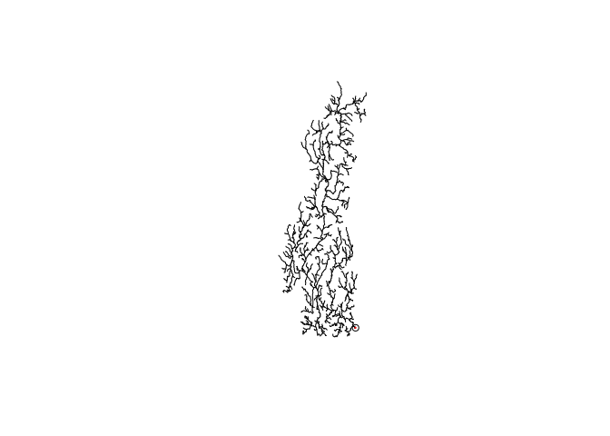

<!-- README.md is generated from README.Rmd. Please edit that file -->
streamnet
=========

Morphology analysis of stream networks

Installation
------------

You can install streamnet from github with:

``` r
# install.packages("devtools")
devtools::install_github("jsta/streamnet")
```

Usage
-----

``` r
library(sf)
library(nhdR)
library(streamnet)
library(ggplot2)

data(nhd_sub_lines)
data(nhd_sub_lakes)

outlet_reach   <- terminal_reaches(network = nhd_sub_lines, 
                                   approve_all_dl = TRUE)
outlet_point   <- st_cast(st_line_sample(outlet_reach, sample = 1), "POINT")

plot(nhd_sub_lines$geometry)
plot(outlet_reach$geometry, add = TRUE, col = "red", lwd = 2)
plot(outlet_point, add = TRUE)
```



``` r

# avg link_length
nhd_sub_simple <- simplify_network(nhd_sub_lines)
avg_link_length(nhd_sub_simple)
avg_link_length(nhd_sub_lines)

# stream order ratio
res <- stream_order(nhd_sub_lines, outlet = outlet_point)
#> Warning in rgrass7sf::execGRASS("v.stream.order", parameters = list(input = "testlines", : The command:
#> v.stream.order --quiet input=testlines points=testoutlet output=test
#> produced at least one warning during execution:
#> WARNING: Column name conflict: Renaming column <cat> from input map into
#>          cat_1 in output map
stream_order_ratio(nhd_sub_lines, outlet = outlet_point)
#> Warning in rgrass7sf::execGRASS("v.stream.order", parameters = list(input = "testlines", : The command:
#> v.stream.order --quiet input=testlines points=testoutlet output=test
#> produced at least one warning during execution:
#> WARNING: Column name conflict: Renaming column <cat> from input map into
#>          cat_1 in output map

# distance to closest upstream lake
# number of upsream lakes
outlet <- which(outlet_reach$comid == nhd_sub_lines$comid)
closest_lake_distance(nhd_sub_lines, nhd_sub_lakes, outlet = outlet)

# all together now
calc_metrics(nhd_sub_lines, nhd_sub_lakes)
#> Warning in rgrass7sf::execGRASS("v.stream.order", parameters = list(input = "testlines", : The command:
#> v.stream.order --quiet input=testlines points=testoutlet output=test
#> produced at least one warning during execution:
#> WARNING: Column name conflict: Renaming column <cat> from input map into
#>          cat_1 in output map
```
