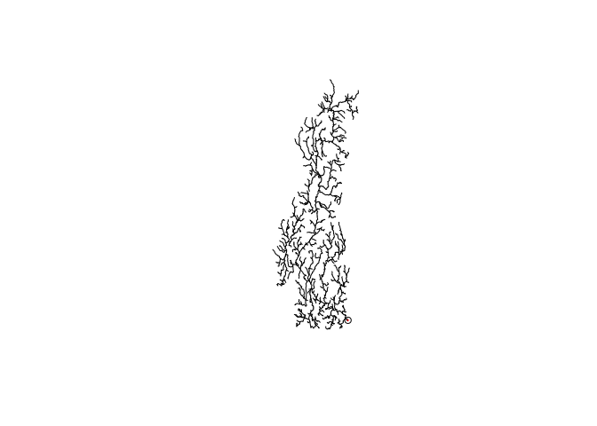

<!-- README.md is generated from README.Rmd. Please edit that file -->
streamnet
=========

Morphology analysis of stream networks

Installation
------------

You can install streamnet from github with:

``` r
# install.packages("devtools")
devtools::install_github("jsta/streamnet")
```

Usage
-----

``` r
library(sf)
library(nhdR)
library(streamnet)
library(ggplot2)

data(nhd_sub_lines)
data(nhd_sub_lakes)

outlet_reach   <- terminal_reaches(network = nhd_sub_lines, 
                                   approve_all_dl = TRUE)
outlet_point   <- st_cast(st_line_sample(outlet_reach, sample = 1), "POINT")

plot(nhd_sub_lines$geometry)
plot(outlet_reach$geometry, add = TRUE, col = "red", lwd = 2)
plot(outlet_point, add = TRUE)
```



``` r

# avg link_length
nhd_sub_simple <- simplify_network(nhd_sub_lines)
avg_link_length(nhd_sub_simple)
#> 2444.693 m
avg_link_length(nhd_sub_lines)
#> 1312.988 m

# stream order ratio
res <- stream_order(nhd_sub_lines, outlet = outlet_point)
#> WARNING: Column name conflict: Renaming column <cat> from input map into
#>          cat_1 in output map
stream_order_ratio(nhd_sub_lines, outlet = outlet_point)
#> WARNING: Column name conflict: Renaming column <cat> from input map into
#>          cat_1 in output map
#> [1] 0.5478762

# distance to closest upstream lake
# number of upsream lakes
outlet <- which(outlet_reach$comid == nhd_sub_lines$comid)
closest_lake_distance(nhd_sub_lines, nhd_sub_lakes, outlet = outlet)
#> Reading layer `NHDWaterbody' from data source `/home/jose/.local/share/nhdR/NHDPlus/NE_01_NHDSnapshot/NHDWaterbody.shp' using driver `ESRI Shapefile'
#> Simple feature collection with 16791 features and 12 fields
#> geometry type:  POLYGON
#> dimension:      XYZ
#> bbox:           xmin: -73.73183 ymin: 41.00171 xmax: -66.99787 ymax: 47.41783
#> epsg (SRID):    4269
#> proj4string:    +proj=longlat +datum=NAD83 +no_defs
#> Reading layer `NHDWaterbody' from data source `/home/jose/.local/share/nhdR/NHDPlus/MA_02_NHDSnapshot/NHDWaterbody.shp' using driver `ESRI Shapefile'
#> Simple feature collection with 19576 features and 12 fields
#> geometry type:  POLYGON
#> dimension:      XYZ
#> bbox:           xmin: -80.20945 ymin: 36.43454 xmax: -71.88713 ymax: 45.01541
#> epsg (SRID):    4269
#> proj4string:    +proj=longlat +datum=NAD83 +no_defs
#> $closest_lake_distance
#> [1] 17861.86
#> 
#> $num_up_lakes
#> [1] 82

# all together now
calc_metrics(nhd_sub_lines, nhd_sub_lakes)
#> WARNING: Column name conflict: Renaming column <cat> from input map into
#>          cat_1 in output map
#> Reading layer `NHDWaterbody' from data source `/home/jose/.local/share/nhdR/NHDPlus/NE_01_NHDSnapshot/NHDWaterbody.shp' using driver `ESRI Shapefile'
#> Simple feature collection with 16791 features and 12 fields
#> geometry type:  POLYGON
#> dimension:      XYZ
#> bbox:           xmin: -73.73183 ymin: 41.00171 xmax: -66.99787 ymax: 47.41783
#> epsg (SRID):    4269
#> proj4string:    +proj=longlat +datum=NAD83 +no_defs
#> Reading layer `NHDWaterbody' from data source `/home/jose/.local/share/nhdR/NHDPlus/MA_02_NHDSnapshot/NHDWaterbody.shp' using driver `ESRI Shapefile'
#> Simple feature collection with 19576 features and 12 fields
#> geometry type:  POLYGON
#> dimension:      XYZ
#> bbox:           xmin: -80.20945 ymin: 36.43454 xmax: -71.88713 ymax: 45.01541
#> epsg (SRID):    4269
#> proj4string:    +proj=longlat +datum=NAD83 +no_defs
#> $avg_link_length
#> 2444.693 m
#> 
#> $stream_order_ratio
#> [1] 0.5478762
#> 
#> $closest_lake_distance
#> [1] 17861.86
#> 
#> $num_up_lakes
#> [1] 82
```
