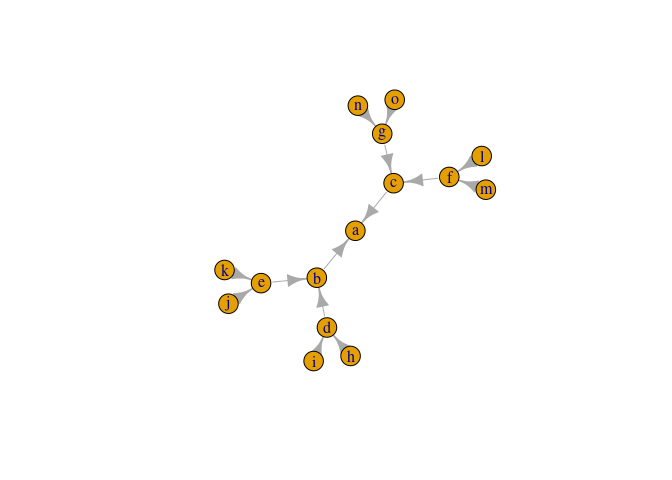
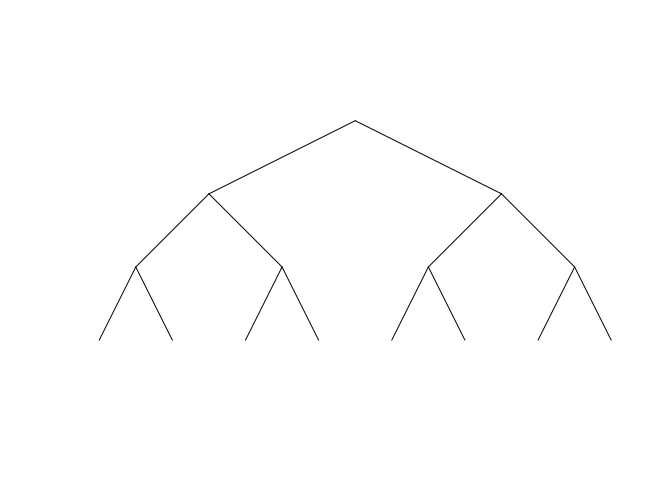
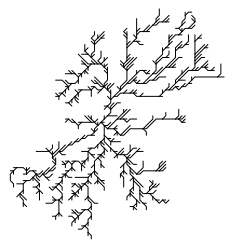
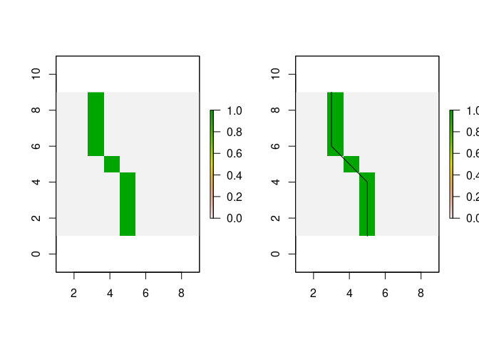

<!-- README.md is generated from README.Rmd. Please edit that file -->

# streamnet

[](https://cran.r-project.org/package=streamnet)
[](https://www.tidyverse.org/lifecycle/#experimental)
[](https://travis-ci.org/jsta/streamnet)
[](https://zenodo.org/badge/latestdoi/104792308)

Morphology analysis of stream networks

## Installation

You can install streamnet from github with:

``` r
# install.packages("devtools")
devtools::install_github("jsta/streamnet")
```

In addition, many functions require a system installation of [GRASS
7](https://grass.osgeo.org/) along with the
[v.stream.order](https://grass.osgeo.org/grass74/manuals/addons/v.stream.order.html)
extension.

There is a helper function to install `v.stream.order` at
`streamnet:::install_grass_extensions`.

## Usage

### Calculate morphology metrics

``` r
library(sf)
library(nhdR)
library(streamnet)
library(ggplot2)
library(raster)
```

``` r
data(nhd_sub_lines)
data(nhd_sub_lakes)

outlet_reach   <- terminal_reaches(network = nhd_sub_lines, 
                                   approve_all_dl = TRUE, quiet = TRUE)
outlet_point   <- st_cast(st_line_sample(outlet_reach, sample = 1), "POINT")

ggplot() +
  geom_sf(data = nhd_sub_lines) +
  geom_sf(data = outlet_point, aes(color = "red")) +
  scale_color_manual(labels = "outlet", values = "red") +
  labs(colour = "") + theme_minimal()

calc_metrics(nhd_sub_lines, nhd_sub_lakes)
```

### Simplify stream networks

``` r
data(nhd_sub_lines)

# Combine(dissolve) adjacent reaches with no junctions
nhd_sub_simple <- simplify_network(nhd_sub_lines)
avg_link_length(nhd_sub_simple)
#> 2444.693 [m]
avg_link_length(nhd_sub_lines)
#> 1312.988 [m]
```

### Round-trip igraph and sf lines

``` r
tree <- create_reversed_tree(15)
class(tree)
#> [1] "igraph"
plot(tree)
```

<!-- -->

``` r
tree_sf <- igraph2sf(tree)
plot(tree_sf)
```

<!-- -->

### Create synthetic stream networks

``` r
# Diffusion limited aggregation
dt <- sim_dla()
viz_dla(dt, which.max(dt))
```

<!-- -->

``` r
# Generate from a binary raster
foo <- matrix(0, ncol = 9, nrow = 9)
foo[1:4,3] <- 1
foo[5,4]   <- 1
foo[6:9,5] <- 1
foo <- raster(foo, xmn = 1, xmx = 9, ymn = 1, ymx = 9)
origin <- which.min(apply(
              which(as.matrix(flip(foo, "y")) == 1, arr.ind = TRUE), 1, sum))
res <- raster2network(foo, origin)

par(mfrow = c(1, 2))
plot(foo)
plot(foo); plot(res, add = TRUE)
```

<!-- -->
