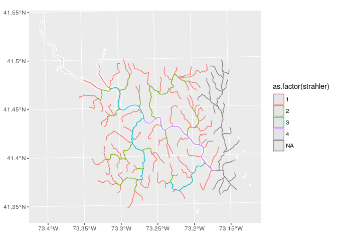

<!-- README.md is generated from README.Rmd. Please edit that file -->
streamnet
=========

Morphology analysis of stream networks

Installation
------------

You can install streamnet from github with:

``` r
# install.packages("devtools")
devtools::install_github("jsta/streamnet")
```

Usage
-----

<details> <summary>Generate test stream network</summary>

``` r
library(sf)
#> Linking to GEOS 3.5.1, GDAL 2.2.1, proj.4 4.9.2
library(ggplot2)
library(nhdR)
#> Loading required package: maps
library(streamnet)

# Generate test dataset
bbox <- data.frame(xmin = -73.33838, ymin = 41.35841,
                   xmax = -73.14540, ymax = 41.48593)
b0 <- sf::st_sfc(sf::st_polygon(list(rbind(
    c(bbox$xmin, bbox$ymin),
    c(bbox$xmax, bbox$ymin),
    c(bbox$xmax, bbox$ymax),
    c(bbox$xmin, bbox$ymax),
    c(bbox$xmin, bbox$ymin)))))
sf::st_crs(b0) <- 4326
b0 <- st_transform(b0, sf::st_crs(nhdR::vpu_shp))

outlet_reach <- terminal_reaches(
                 lon = st_coordinates(st_centroid(b0))[1], 
                 lat = st_coordinates(st_centroid(b0))[2], 
                 approve_all_dl = TRUE)
#> Warning in st_centroid.sfc(b0): st_centroid does not give correct centroids
#> for longitude/latitude data

#> Warning in st_centroid.sfc(b0): st_centroid does not give correct centroids
#> for longitude/latitude data
#> although coordinates are longitude/latitude, st_intersects assumes that they are planar
#> although coordinates are longitude/latitude, st_intersects assumes that they are planar
#> Reading layer `NHDWaterbody' from data source `/home/jose/.local/share/nhdR/NHDPlus/NE_01_NHDSnapshot/NHDWaterbody.shp' using driver `ESRI Shapefile'
#> Simple feature collection with 16791 features and 12 fields
#> geometry type:  POLYGON
#> dimension:      XYZ
#> bbox:           xmin: -73.73183 ymin: 41.00171 xmax: -66.99787 ymax: 47.41783
#> epsg (SRID):    4269
#> proj4string:    +proj=longlat +datum=NAD83 +no_defs
#> Warning in st_buffer.sfc(pnt, dist = buffer_dist): st_buffer does not
#> correctly buffer longitude/latitude data
#> dist is assumed to be in decimal degrees (arc_degrees).
#> although coordinates are longitude/latitude, st_intersects assumes that they are planar
#> Reading layer `NHDFlowline' from data source `/home/jose/.local/share/nhdR/NHDPlus/NE_01_NHDSnapshot/NHDFlowline.shp' using driver `ESRI Shapefile'
#> Simple feature collection with 68837 features and 14 fields
#> geometry type:  LINESTRING
#> dimension:      XYZM
#> bbox:           xmin: -73.7318 ymin: 40.98537 xmax: -66.94983 ymax: 47.45986
#> epsg (SRID):    4269
#> proj4string:    +proj=longlat +datum=NAD83 +no_defs
outlet_point <- st_cast(st_line_sample(outlet_reach, sample = 1), "POINT")

nhd <- nhd_plus_query(poly = b0, dsn = c("NHDFlowLine"))$sp$NHDFlowLine
#> although coordinates are longitude/latitude, st_intersects assumes that they are planar
#> Reading layer `NHDFlowline' from data source `/home/jose/.local/share/nhdR/NHDPlus/NE_01_NHDSnapshot/NHDFlowline.shp' using driver `ESRI Shapefile'
#> Simple feature collection with 68837 features and 14 fields
#> geometry type:  LINESTRING
#> dimension:      XYZM
#> bbox:           xmin: -73.7318 ymin: 40.98537 xmax: -66.94983 ymax: 47.45986
#> epsg (SRID):    4269
#> proj4string:    +proj=longlat +datum=NAD83 +no_defs
```

</details>

<details> <summary>Calculate stream order</summary>

``` r
Sys.setenv(GRASS_VERBOSE = -1) # suppress grass messages

res <- stream_order(lines = nhd, outlet = outlet_point)
#> Warning in rgrass7sf::execGRASS("v.stream.order", parameters = list(input = "testlines", : The command:
#> v.stream.order --quiet input=testlines points=testoutlet output=test
#> produced at least one warning during execution:
#> WARNING: Column name conflict: Renaming column <cat> from input map into
#>          cat_1 in output map
#> WARNING: Column name conflict: Renaming column <cat> from input map into
#>          cat_1 in output map

coords <- st_coordinates(st_transform(outlet_point, 4326))
poly   <- nhd_plus_query(coords[1], coords[2], 
                        dsn = "NHDWaterbody")$sp$NHDWaterbody
#> although coordinates are longitude/latitude, st_intersects assumes that they are planar
#> Reading layer `NHDWaterbody' from data source `/home/jose/.local/share/nhdR/NHDPlus/NE_01_NHDSnapshot/NHDWaterbody.shp' using driver `ESRI Shapefile'
#> Simple feature collection with 16791 features and 12 fields
#> geometry type:  POLYGON
#> dimension:      XYZ
#> bbox:           xmin: -73.73183 ymin: 41.00171 xmax: -66.99787 ymax: 47.41783
#> epsg (SRID):    4269
#> proj4string:    +proj=longlat +datum=NAD83 +no_defs
#> Warning in st_buffer.sfc(pnt, dist = buffer_dist): st_buffer does not
#> correctly buffer longitude/latitude data
#> dist is assumed to be in decimal degrees (arc_degrees).

ggplot() + 
  geom_sf(data = poly, color = "white") +
  geom_sf(data = res, aes(color = as.factor(strahler)))
```

 </details>

<details> <summary>Calculate average link length</summary>

``` r
avg_link_length(lines = nhd, outlet_reach = outlet_reach)
#> 
#>  Units: m
#> 1515.943 m
```

</details>

<details> <summary>Calculate distance to closest upstream lake</summary>

``` r
1 + 1
#> [1] 2
```

</details>
